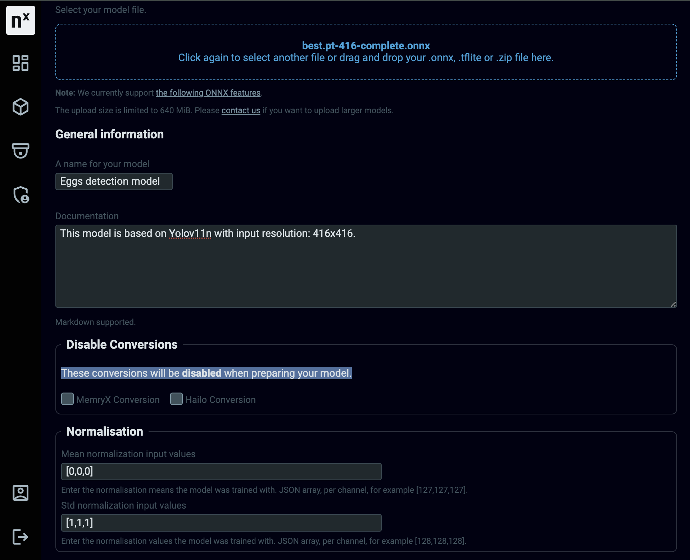
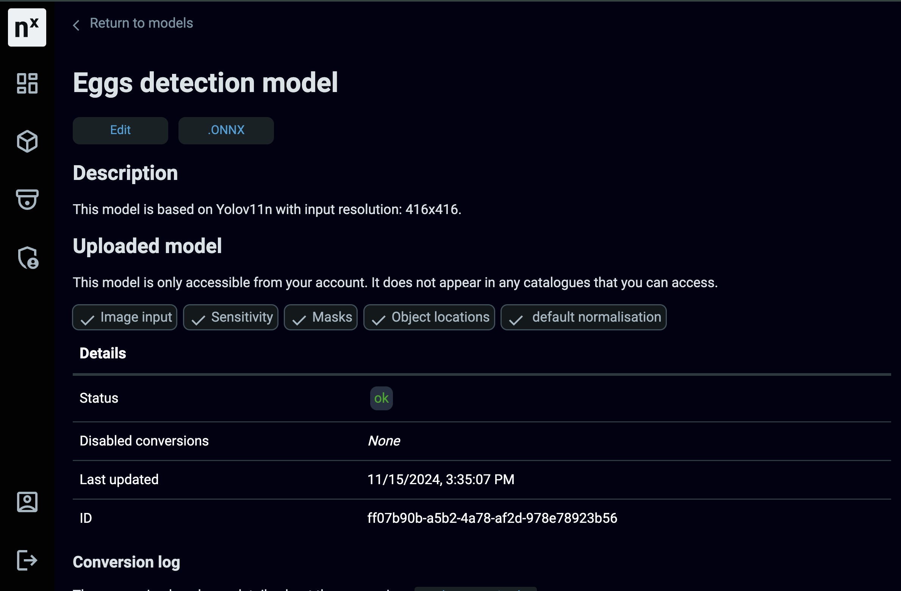

# Ultralytics Support

This repository provides a detailed guide for Network Optix AI model developer to integrate their models with Network Optix VMS, precisely the Nx AI Manager.  

> For more information about the Nx AI Manager  and its capabilities, please visit the [Nx AI Manager documentation](https://nx.docs.scailable.net/) website.

## Table of Contents

1. [Introduction](#introduction)
2. [Prerequisites](#prerequisites)
3. [Dataset](#dataset)
4. [Model Development](#model-development)
5. [Model Deployment](#model-deployment)
6. [Model Integration](#model-integration)
7. [Support](#support)

## Introduction

For the sake of example, this guide will involve the training and deployment of an object detection model using the YOLOv11 architecture. The model will be trained on a custom dataset to detect chicken and eggs and then integrated with the Nx AI Manager.

## Prerequisites

- x86_64 based Linux machine, preferably Ubuntu 20.04 or later.
- Python 3.10 or later.
- Repository cloned: `git clone ...`
- Requirements installed: `pip install -r requirements.txt  --user`
- Network Optix AI Manager installed on the target machine.
- Roboflow account to download the dataset.

## Dataset

The dataset used for training the model can be downloaded from the following link: [Chicken and Egg Dataset](https://universe.roboflow.com/egg-detection-mixed-eggs/egg-detection-model-4wo1k/dataset/3).

You can download the dataset in the YOLOv11 format directly from the Roboflow platform, or by using the following command:

```bash
export ROBOFLOW_API_KEY=<replace-api-key>
python3 src/download_data.py
```
The script will download the dataset in the YOLOv11 format and extract it to the `src/eggs-dataset` directory.

## Model Development

The model will be developed using the YOLOv11n architecture. A generic training script is provided in the `src/train.py` file. To customize it, please refer to these [examples](https://docs.ultralytics.com/modes/train/#usage-examples).

To train the model, run the following command:

```bash
python3 src/train.py --model yolo11n.pt --data src/eggs-dataset/data.yaml --epochs 1 --imgsz 416 --device cpu --batch_size 8
```

> The model training might take minutes to hours, depending on the machine's computational power; use a GPU for faster training.  

After training, the model will be saved in the `runs/detect/train` directory. Feel free to examine the model's performance by reviewing the training logs and the generated images and charts, which are saved in the same directory.   
If the model's performance is satisfactory, proceed to the next step. Otherwise, consider retraining the model with different [hyperparameters](https://docs.ultralytics.com/modes/train/#train-settings).


## Model Deployment

To deploy with the Nx AI Manager, the model must be converted to the ONNX format. The `src/deploy.sh` script will convert the model to ONNX and save it in the `runs/detect/train` directory.

```bash
bash src/export.sh ./runs/detect/train/weights/best.pt 416 B-eggs W-eggs
```
>The general syntax for the script is: `bash src/export.sh <pt_path> <imgsz> <class1> <class2> ... <classN>`

To integrate the model with the Nx AI Manager, the ONNX model must be uploaded to the [Nx AI Cloud](https://admin.sclbl.nxvms.com/create), as shown in the image below:



> If you don't have an account, you can create one for free by following these instructions: [Nx AI Cloud Account Creation](https://nx.docs.scailable.net/nx-ai-cloud/registration).

After uploading the model, it will take a couple of minutes for it to be ready to run. The model page will have a green `ok` status when it is ready, as shown in the image below:



## Model Integration

To use the trained model, you need to need to have the Nx Meta VMS installed on your machine. Addionally, you need to have the Nx AI Manager installed and running.  
You can follow the instructions in the [Nx AI Manager documentation](https://nx.docs.scailable.net/nx-ai-manager/1.-install-network-optix) to install and configure the Nx AI Manager.

The model can then be deployed by following the steps mentioned [here](https://nx.docs.scailable.net/nx-ai-manager/2.-configure-the-nx-ai-manager-plugin).

> We recommend to test the AI Manager using one of the default models before integrating your custom model, to ensure that the AI Manager is working correctly on your machine.

The model's output should looks something like this:

TODO: Add image

## Support

For any questions or issues, please checkout this support [page](https://nx.docs.scailable.net/support-and-troubleshooting/how-to-get-support).